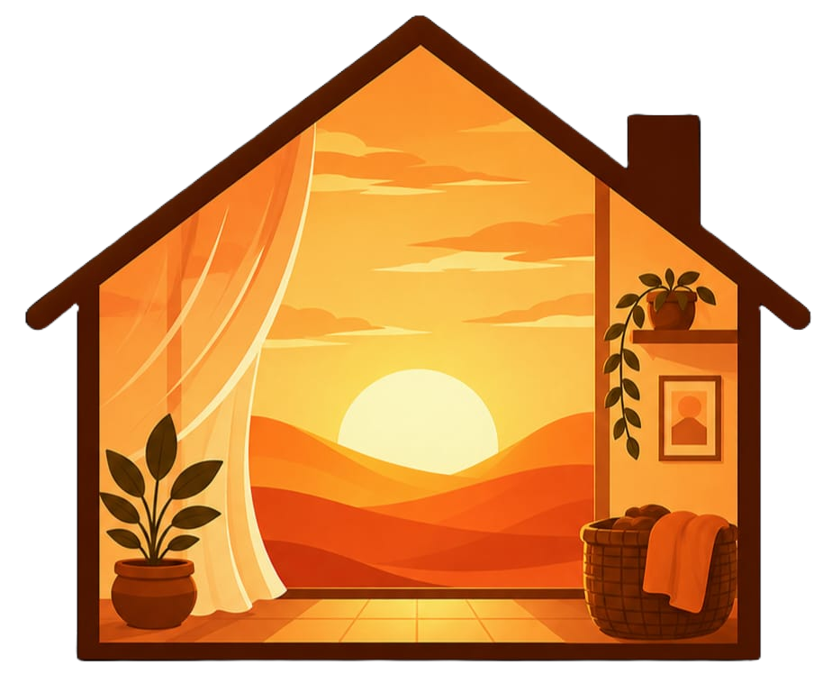

  

<h1 align="center">Por Trás da Casa</h1>

  <strong>Conscientização, apoio e divisão justa do trabalho doméstico.</strong>

---

## 🎯 Objetivo do Projeto

Muitas vezes, a gestão do lar — como limpar, cozinhar, lavar roupas e organizar a rotina — consome horas do dia sem o devido reconhecimento ou divisão justa de responsabilidades. 

O projeto surge com a missão de:
- **Conscientizar:** Trazer dados e reflexões sobre o trabalho invisível e o tempo dedicado à manutenção do lar.
- **Organizar:** Facilitar a distribuição de rotinas e tarefas diárias entre os membros da família.
- **Capacitar:** Oferecer conteúdos educativos e cursos profissionalizantes para o desenvolvimento pessoal e fortalecimento da autonomia.

---

## 📑 Funcionalidades e Estrutura

- **🏠 Divisor de Tarefas:** Ferramenta dedicada para a criação e organização equilibrada de rotinas domésticas.
- **📊 Seção Informativa ("O Trabalho que Ninguém Vê"):** Conteúdos explicativos e dados estatísticos sobre o impacto social do trabalho doméstico.
- **🎓 Área de Cursos:** Capacitações gratuitas e conteúdos focados no desenvolvimento pessoal e profissional (incluindo *Inglês Básico*).
- **👥 Sobre Nós:** Apresentação da iniciativa acadêmica/social e do propósito por trás do projeto.
- **✉️ Contato & SAC:** Canal aberto para dúvidas, sugestões e feedbacks da comunidade.
- **🔐 Sistema de Autenticação:** Tela de login para acesso e acompanhamento personalizado.

---

## 🛠️ Tecnologias Utilizadas

- **HTML5:** Estrutura semântica das páginas web.
- **CSS3:** Estilização visual, layout responsivo e transições.
- **JavaScript (ES6):** Manipulação de elementos interativos.
- **Font Awesome:** Ícones vetoriais integrados na interface.

---

## 👥 Sobre os Idealizadores

Este projeto foi concebido e desenvolvido por um grupo de estudantes com o propósito de colocar em prática uma ação social e beneficente. Através da tecnologia e da informação, buscamos incentivar transformações positively e promover o apoio mútuo nas rotinas familiares.

---

## 📄 Licença

Este projeto foi desenvolvido para fins educacionais e de conscientização social.

© 2026 Por Trás da Casa - Apoio e Divisão de Tarefas Domésticas.
